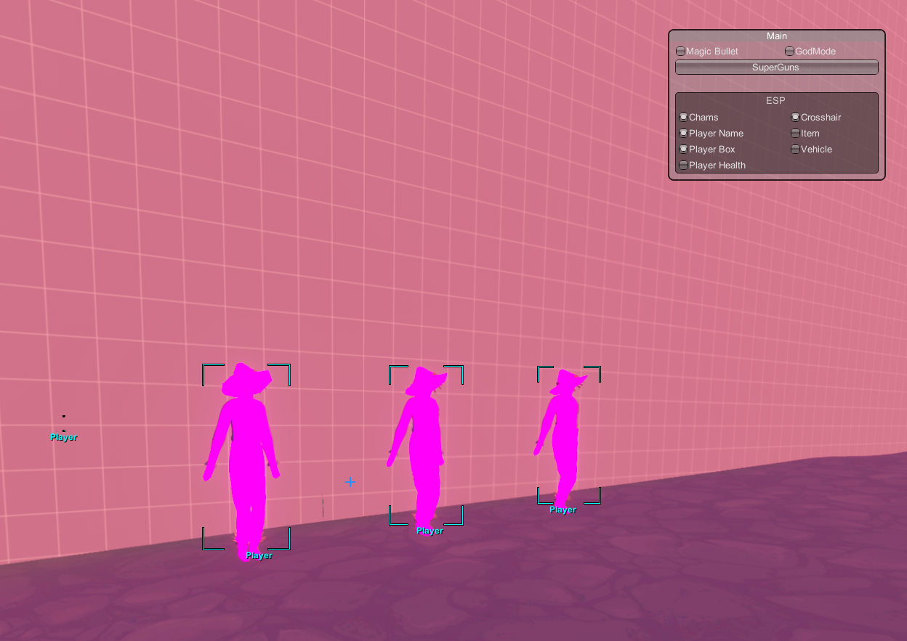

# How to build

1. Open the project in Visual Studio or Rider
2. Reference most dlls in `<gameDirectory>/TotallyAccurateBattlegrounds_Data/Managed`
3. Fix any out of date references
4. Build

# How to Use

1. Download and install BepInEx
2. Place the built dll in `<gameDirectory>/BepInEx/plugins`
3. Open the game
4. Press `Insert` to toggle the UI

# How I tested this

If you read the repository description, you'd know I don't have an EAC bypass, so how did I use BepInEx?

1. Rename the EAC `TABG_Launcher.exe` to anything else (or delete it)
2. Rename `TotallyAccurateBattlegrounds.exe` to `TABG_Launcher.exe`
3. Rename `TotallyAccurateBattlegrounds_Data` to `TABG_Launcher_Data`
4. Launch the game through Steam (or don't and see what happens)
5. Do NOT click `OK` on the "Failed to load anti-cheat" notification, it will close the game

You *can* join servers, but you will be kicked for not having EAC active after a little bit. I don't think this will ban you, I've done it a couple times and I'm fine.

# Features

- [x] Crosshair
- [x] Player ESP (Box/Name/Chams)
- [ ] Player ESP (Health)
- [x] Item ESP
- [x] Vehicle ESP
- [x] Speed Modifier
- [x] Jump Modifier
- [x] Launch
- [ ] No Fall Stun
- [x] Godmode (Can Still Die)
- [x] Magic Bullet (Instakill Nearby Players)
- [x] Super Guns (Fast/No Recoil/Infinite Ammo/No Spread)
- [ ] Strong Punch
- [ ] Spawn Items

# Media

**Note:** I use a 4K monitor, so UI elements may be inaccurate.

